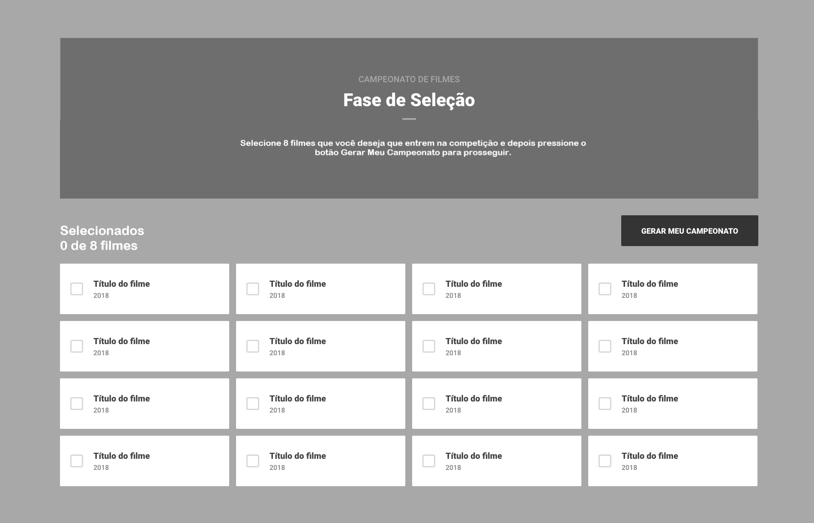
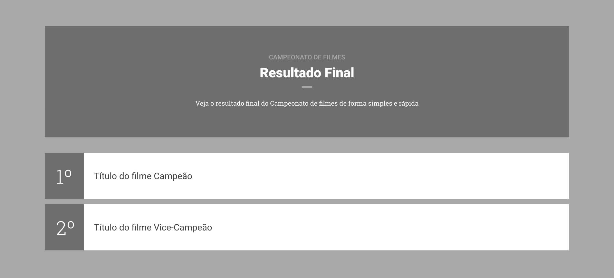

## Aqui estou transformando essa img em código para praticar CSS.

## A primeira parte do projeto está completa. Agora apenas precisa refatorar e aperfeiçoar o melhor que puder.

## Esta é a segunda parte do projeto:

